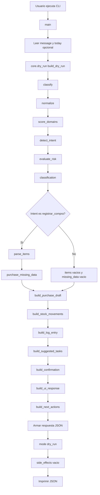
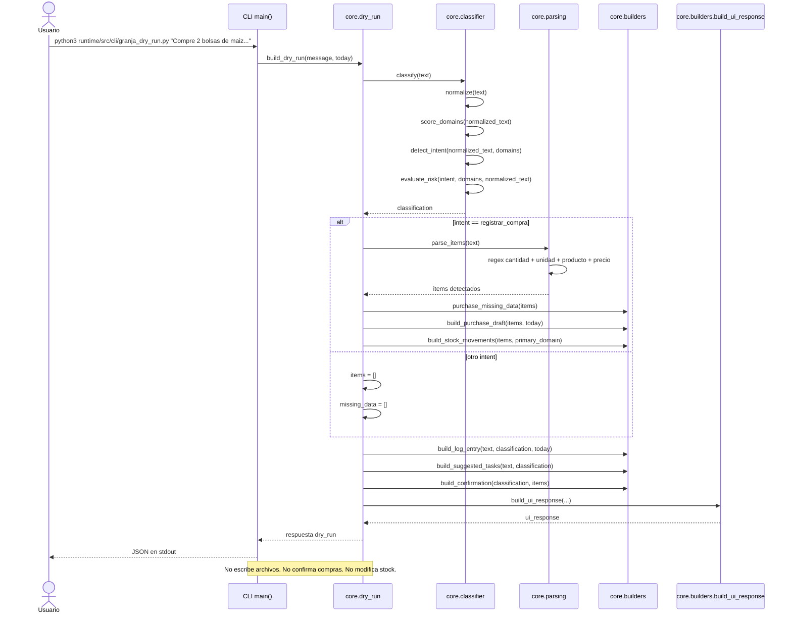
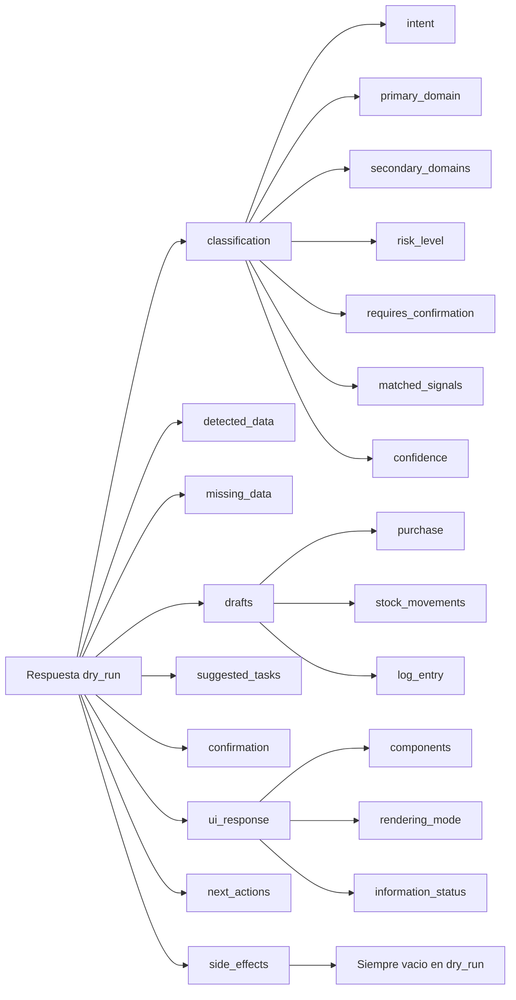

# Diagrama: `granja_dry_run.py`

Estado: `draft`

Este documento explica el flujo del CLI `dry_run` de Granja Luna.

No es una especificacion completa del runtime. Es una ayuda visual para entender como el script transforma un mensaje natural en una respuesta JSON estructurada, sin usar LLM, sin framework agentico y sin modificar archivos.

Archivos relacionados:

- `runtime/src/cli/granja_dry_run.py`;
- `runtime/src/core/dry_run.py`;
- `runtime/src/core/classifier.py`;
- `runtime/src/core/parsing.py`;
- `runtime/src/core/builders.py`.

## Idea general

El CLI recibe un mensaje, aplica reglas locales, prepara borradores y devuelve una respuesta en modo `dry_run`.

La regla central es:

```text
analizar y proponer, no ejecutar ni registrar hechos reales
```

## Flujo principal



## Secuencia de ejecucion



## Mapa de salida



## Ejemplo mental

Entrada:

```text
Compre 2 bolsas de maiz a 95000 cada una
```

Lectura del flujo:

1. `classify` detecta senales de `compras`, `stock-insumos` y `alimentacion`.
2. Como aparece una compra, la intencion queda `registrar_compra`.
3. El riesgo queda `medio`, por impacto operativo/economico.
4. `parse_items` detecta:
   - cantidad: `2`;
   - unidad: `bolsa`;
   - producto: `maiz`;
   - precio unitario: `95000`.
5. Se infiere subtotal: `190000`.
6. Se prepara un borrador de compra.
7. Se propone un movimiento de stock de tipo `entrada`.
8. Se crea una `ui_response` con componentes para revisar datos, faltantes y acciones.
9. La salida mantiene `side_effects: []`.

La clasificacion tambien incluye:

- `matched_signals`: senales que explican por que se detectaron dominios;
- `domain_scores`: cantidad de senales por dominio;
- `confidence`: confianza inicial del router, por ahora `low` o `medium`.

## Funciones principales

| Funcion | Rol |
|---|---|
| `main` | Lee argumentos del CLI e imprime JSON. |
| `core.dry_run.build_dry_run` | Coordina todo el flujo. |
| `core.classifier.classify` | Define intencion, dominios, riesgo y confirmacion requerida. |
| `core.classifier.match_domain_signals` | Explica que palabras o frases activaron cada dominio. |
| `core.parsing.parse_items` | Extrae items de compra con reglas simples. |
| `core.builders.build_purchase_draft` | Prepara borrador de compra. |
| `core.builders.build_stock_movements` | Propone movimientos de stock derivados de compras. |
| `core.builders.build_log_entry` | Prepara entrada de bitacora en borrador. |
| `core.builders.build_suggested_tasks` | Propone tareas si detecta senales como revisar o limpiar. |
| `core.builders.build_confirmation` | Formula la pregunta de confirmacion. |
| `core.builders.build_ui_response` | Prepara componentes renderizables por una app host. |

## Limites actuales

- No usa LLM.
- No entiende frases complejas.
- No valida contra productos reales.
- No consulta stock real.
- No escribe en bitacora.
- No registra compras confirmadas.
- No modifica inventario.

Estos limites son intencionales para el MVP 0.1.
